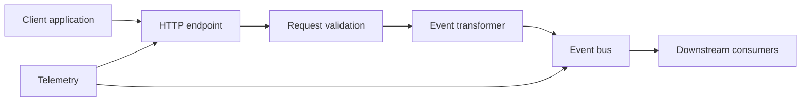

# HTTP to event flow

```mermaid
flowchart LR
    Client[Client application] --> Gateway[HTTP endpoint]
    Gateway --> Validation[Request validation]
    Validation --> Transform[Event transformer]
    Transform --> Bus[Event bus]
    Bus --> Consumers[Downstream consumers]
    Observability[Telemetry] --> Gateway
    Observability --> Bus
```

This starter keeps the first integration narrow and focused: accept a synchronous request, translate it into a well-formed event, and hand off downstream work asynchronously.
