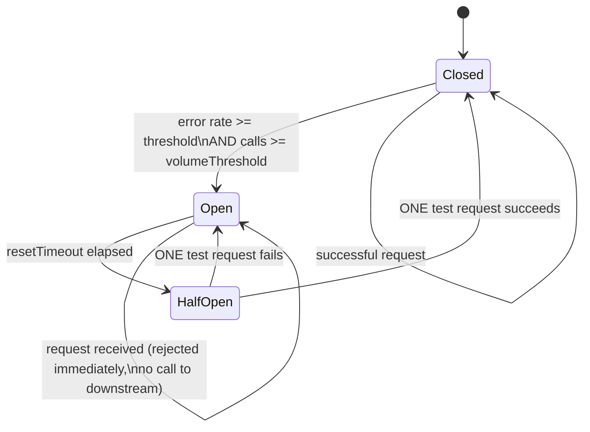

# REST API Client Starter - Resilience Patterns

Resilient HTTP client for Node.js services calling external REST APIs. Implements retry, circuit breaker, correlation ID propagation, and response caching.

## Circuit Breaker State Machine



**Important:** In `HalfOpen` state, only ONE test request is allowed through. This is intentional - the goal is to probe whether the downstream has recovered without sending a flood of traffic. The next request after a half-open success or failure changes state immediately.

## Retry Strategy

Exponential backoff with jitter on retryable status codes:
- `429 Too Many Requests` - rate limit hit
- `5xx Server Error` - downstream is failing

Not retried:
- `4xx` (except 429) - client errors, retrying won't help

```
Attempt 1: immediate
Attempt 2: ~200ms + jitter
Attempt 3: ~400ms + jitter
Attempt 4: give up, throw
```

## Correlation ID Propagation

Every outbound request includes `X-Correlation-ID`. The value comes from `AsyncLocalStorage` set by `correlationMiddleware` on inbound requests. If no context is found, a new UUID is generated.

**Express setup:**

```typescript
import express from 'express';
import { correlationMiddleware } from './correlation-context';

const app = express();
app.use(correlationMiddleware); // Must be first middleware

// All downstream HTTP calls from handlers will propagate X-Correlation-ID automatically
```

Log the correlation ID in every log line for end-to-end request tracing across services.

## Usage

```typescript
import { ResilientHttpClient } from './resilient-client';

const inventoryClient = new ResilientHttpClient({
  baseURL: 'https://inventory.internal',
  timeout: 10_000,
  circuitBreaker: {
    errorThresholdPercentage: 50,
    resetTimeout: 30_000,
    volumeThreshold: 10, // Don't trip on startup noise
  },
  cache: {
    ttl: 30_000, // Cache GET responses for 30s
  },
});

// GET with caching
const product = await inventoryClient.get<Product>(`/products/${id}`);

// POST (not cached)
const reservation = await inventoryClient.post<Reservation>('/reservations', {
  productId: id,
  quantity: 2,
});

// Health check endpoint
app.get('/health', (req, res) => {
  const circuitOpen = inventoryClient.isCircuitOpen();
  res.json({ status: circuitOpen ? 'degraded' : 'ok', inventoryCircuit: circuitOpen ? 'open' : 'closed' });
});
```

## Configuration Reference

| Option | Default | Description |
|--------|---------|-------------|
| `timeout` | 10000 | Request timeout in ms |
| `circuitBreaker.errorThresholdPercentage` | 50 | Error rate % to open circuit |
| `circuitBreaker.timeout` | 5000 | Request timeout for breaker (ms) |
| `circuitBreaker.resetTimeout` | 30000 | Time before half-open test (ms) |
| `circuitBreaker.volumeThreshold` | 10 | Min calls before error % evaluated |
| `cache.ttl` | 60000 | GET cache TTL in ms |

## Tests

```bash
npm test
```

Unit tests cover: successful request, retry on 429, circuit breaker opens at threshold, circuit rejects fast when open, correlation ID injection.
